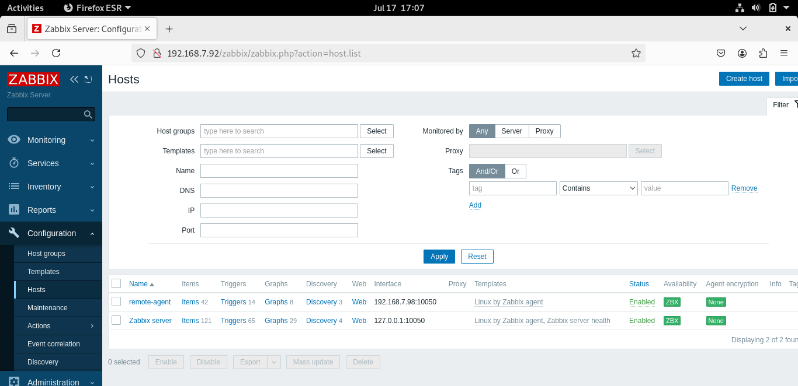
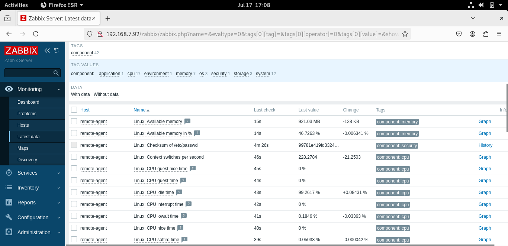
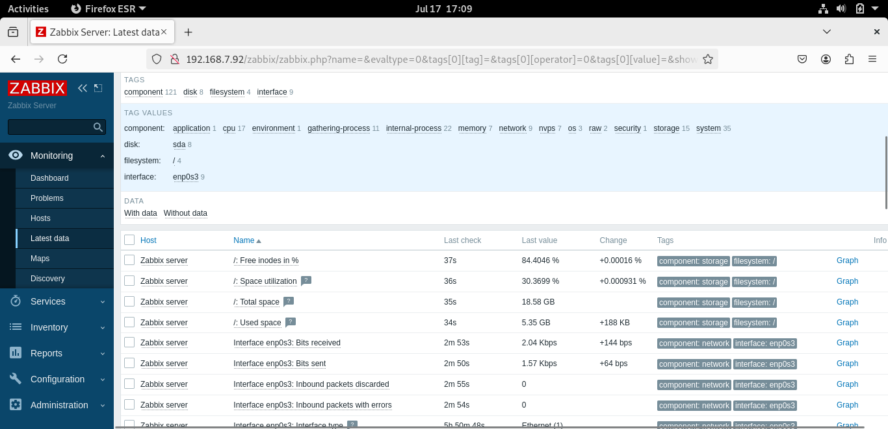
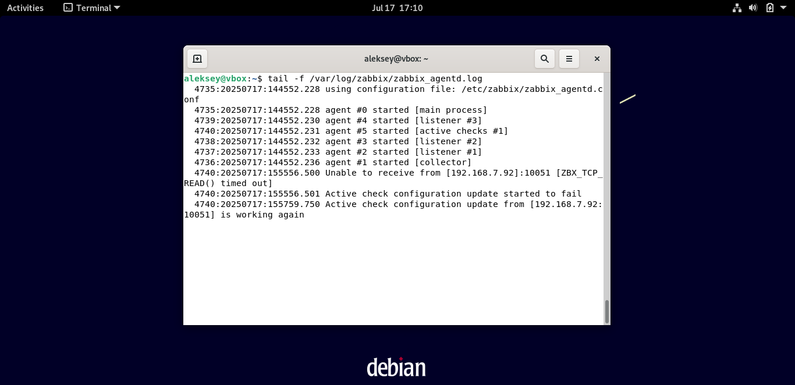

# Домашнее задание к занятию "`Система мониторинга Zabbix`" - `Андреев Алексей`


### Инструкция по выполнению домашнего задания

 1. Сделайте fork репозитория c шаблоном решения к себе в Github и переименуйте его по названию или номеру занятия, например, https://github.com/имя-вашего-репозитория/gitlab-hw или https://github.com/имя-вашего-репозитория/8-03-hw).
 2. Выполните клонирование этого репозитория к себе на ПК с помощью команды git clone.
 3. Выполните домашнее задание и заполните у себя локально этот файл README.md:
  - впишите вверху название занятия и ваши фамилию и имя;
  - в каждом задании добавьте решение в требуемом виде: текст/код/скриншоты/ссылка;
  - для корректного добавления скриншотов воспользуйтесь инструкцией «Как вставить скриншот в шаблон с решением»;
  - при оформлении используйте возможности языка разметки md. Коротко об этом можно посмотреть в инструкции по MarkDown.
 4. После завершения работы над домашним заданием сделайте коммит (git commit -m "comment") и отправьте его на Github (git push origin).
 5. Для проверки домашнего задания преподавателем в личном кабинете прикрепите и отправьте ссылку на решение в виде md-файла в вашем Github.
 6. Любые вопросы задавайте в чате учебной группы и/или в разделе «Вопросы по заданию» в личном кабинете.
   
Желаем успехов в выполнении домашнего задания!
   
### Дополнительные материалы, которые могут быть полезны для выполнения задания

1. [Руководство по оформлению Markdown файлов](https://gist.github.com/Jekins/2bf2d0638163f1294637#Code)

---

### Задание 1
## Использованные команды:
```bash
sudo apt update && sudo apt upgrade -y
sudo apt install postgresql postgresql-contrib -y
sudo -u postgres psql -c "CREATE DATABASE zabbix;"
sudo -u postgres psql -c "CREATE USER zabbix WITH PASSWORD 'zabbix';"
sudo -u postgres psql -c "GRANT ALL PRIVILEGES ON DATABASE zabbix TO zabbix;"
wget https://repo.zabbix.com/zabbix/6.0/debian/pool/main/z/zabbix-release/zabbix-release_6.0-4+debian11_all.deb 
sudo dpkg -i zabbix-release_6.0-4+debian11_all.deb
sudo apt update
sudo apt install zabbix-server-pgsql zabbix-frontend-php php-pgsql zabbix-apache-conf zabbix-agent -y
tar -xf data.tar.xz
zcat ./usr/share/zabbix-sql-scripts/postgresql/server.sql.gz | sudo -u zabbix psql -d zabbix
sudo sed -i 's/DBPassword=/DBPassword=zabbix/' /etc/zabbix/zabbix_server.conf
sudo sed -i 's/php_value date.timezone Europe\/Riga/php_value date.timezone Europe\/Moscow/' /etc/apache2/conf-enabled/zabbix.conf
sudo systemctl restart apache2
sudo systemctl enable zabbix-server zabbix-agent apache2
sudo systemctl start zabbix-server zabbix-agent
```
Скриншот авторизации


---

### Задание 2

## Использованные команды:

```bash
   sudo apt update
   sudo apt install zabbix-agent -y
```

Скриншот






---


